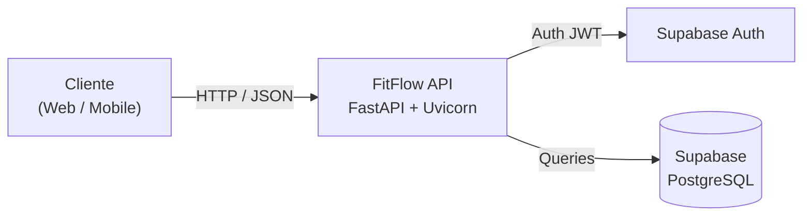

<div align="center">

# FitFlow API

**API RESTful para acompanhamento e gestão de treinos, exercícios e planos de fitness.**

[](https://www.python.org/)
[](https://fastapi.tiangolo.com/)
[](https://supabase.com/)
[](https://www.docker.com/)
[](https://kubernetes.io/)


[Sobre](#sobre-o-projeto) •
[Início Rápido](#início-rápido) •
[Endpoints](#endpoints) •
[Docker](#executar-com-docker) •
[Roadmap](#roadmap)

</div>

---

> [!NOTE]
> **Projeto em desenvolvimento.** A estrutura base e a aplicação FastAPI já estão criadas; os módulos de autenticação, treinos e exercícios estão a ser implementados. Consulta o [Roadmap](#roadmap) para ver o que já está disponível.

## Índice

- [Sobre o Projeto](#sobre-o-projeto)
- [Arquitetura](#arquitetura)
- [Tecnologias Utilizadas](#tecnologias-utilizadas)
- [Estrutura do Projeto](#estrutura-do-projeto)
- [Início Rápido](#início-rápido)
- [Variáveis de Ambiente](#variáveis-de-ambiente)
- [Endpoints](#endpoints)
- [Documentação Interativa](#documentação-interativa)
- [Executar com Docker](#executar-com-docker)
- [Deploy em Kubernetes](#deploy-em-kubernetes)
- [Executar Testes](#executar-testes)
- [Roadmap](#roadmap)
- [Licença](#licença)

---

## Sobre o Projeto

O **FitFlow** é uma aplicação de acompanhamento de fitness. Esta API é o backend que permite aos utilizadores:

| Funcionalidade        | Descrição                                               |
| --------------------- | ------------------------------------------------------- |
| **Autenticação**      | Criar conta e iniciar sessão via Supabase Auth (JWT)    |
| **Exercícios**        | Consultar um catálogo de exercícios                     |
| **Treinos**           | Criar, editar e registar treinos                        |
| **Progresso**         | Acompanhar a evolução ao longo do tempo                 |

---

## Arquitetura



---

## Tecnologias Utilizadas

| Categoria                      | Tecnologia                               |
| ------------------------------ | ---------------------------------------- |
| Linguagem & Framework          | Python 3.11+, FastAPI                    |
| Servidor ASGI                  | Uvicorn                                  |
| Autenticação & Base de Dados   | Supabase (PostgreSQL / GoTrue JWT)       |
| Validação de Dados             | Pydantic, pydantic-settings              |
| Testes                         | Pytest & HTTPX                           |
| Documentação                   | OpenAPI (Swagger UI & ReDoc)             |
| Containerização & Orquestração | Docker, Docker Compose, Kubernetes (k8s) |

---

## Estrutura do Projeto

<details>
<summary><b>Ver árvore de ficheiros</b></summary>

```text
fitflow-api/
├── app/
│   ├── api/              # Endpoints / Rotas da API
│   │   ├── auth.py       #   Registo, login e sessão
│   │   ├── exercises.py  #   Catálogo de exercícios
│   │   └── workouts.py   #   Gestão de treinos
│   ├── core/
│   │   ├── config.py     # Configurações globais (lidas do .env)
│   │   └── supabase.py   # Cliente Supabase
│   ├── schemas/          # Schemas de validação de dados (Pydantic)
│   ├── main.py           # Ponto de entrada do FastAPI
│   └── seed.py           # Script de povoamento inicial de exercícios
├── tests/                # Testes automatizados com Pytest
├── k8s/                  # Manifestos para Kubernetes (Deployment e Service)
├── Dockerfile            # Imagem Docker da aplicação
├── docker-compose.yml    # Orquestração local de serviços
├── requirements.txt      # Dependências do projeto
└── .env                  # Variáveis de ambiente (não versionado)
```

</details>

---

## Início Rápido

### Pré-requisitos

- [Python 3.11+](https://www.python.org/downloads/)
- [Git](https://git-scm.com/)
- Um projeto [Supabase](https://supabase.com) (o plano gratuito é suficiente)
- [Docker & Docker Compose](https://docs.docker.com/get-docker/) _(opcional)_

### Instalação

**1. Clonar o repositório**

```bash
git clone https://github.com/JoaoMeira29/fitflow-api.git
cd fitflow-api
```

**2. Criar e ativar o ambiente virtual**

```bash
python3 -m venv venv
source venv/bin/activate        # Windows: venv\Scripts\activate
```

**3. Instalar as dependências**

```bash
pip install -r requirements.txt
```

**4. Configurar as variáveis de ambiente**

Cria um ficheiro `.env` na raiz do projeto (ver [Variáveis de Ambiente](#variáveis-de-ambiente)).

**5. Iniciar o servidor**

```bash
uvicorn app.main:app --reload
```

A API ficará disponível em <http://127.0.0.1:8000>. Para confirmar que está a funcionar:

```bash
curl http://127.0.0.1:8000/health
```

```json
{ "status": "healthy" }
```

---

## Variáveis de Ambiente

| Variável       | Descrição                                    | Exemplo                           |
| -------------- | -------------------------------------------- | --------------------------------- |
| `SUPABASE_URL` | URL do projeto Supabase                      | `https://seu-projeto.supabase.co` |
| `SUPABASE_KEY` | Chave pública (anon key) do projeto Supabase | `sua-anon-key-do-supabase`        |

Ambos os valores encontram-se no painel do Supabase, em **Project Settings → API**.

```env
SUPABASE_URL=https://seu-projeto.supabase.co
SUPABASE_KEY=sua-anon-key-do-supabase
```

> [!WARNING]
> O ficheiro `.env` contém credenciais e **não deve** ser incluído no repositório.

---

## Endpoints

| Método | Rota         | Descrição                    | Estado                                                            |
| :----: | ------------ | ---------------------------- | ----------------------------------------------------------------- |
| `GET`  | `/`          | Mensagem de boas-vindas      |  |
| `GET`  | `/health`    | Verificação do estado da API |  |
|   —    | `/auth`      | Registo, login e sessão      |   |
|   —    | `/exercises` | Catálogo de exercícios       |   |
|   —    | `/workouts`  | Gestão de treinos            |   |

A lista completa e sempre atualizada está na [documentação interativa](#documentação-interativa).

---

## Documentação Interativa

Com o servidor em execução, a documentação é gerada automaticamente pelo FastAPI:

| Interface      | URL                                |
| -------------- | ---------------------------------- |
| **Swagger UI** | <http://127.0.0.1:8000/docs>       |
| **ReDoc**      | <http://127.0.0.1:8000/redoc>      |

---

## Executar com Docker

Com o ficheiro `.env` configurado:

```bash
docker-compose up --build
```

---

## Deploy em Kubernetes

Os manifestos (Deployment e Service) estão na pasta `k8s/`:

```bash
kubectl apply -f k8s/
```

---

## Executar Testes

```bash
pytest
```

---

## Roadmap

O plano completo — como as tecnologias interagem, o ciclo de um pedido, o modelo de dados e os endpoints planeados — está em **[ROADMAP.html](ROADMAP.html)** (abre no browser).

| Fase | Objetivo                                         | Estado                                                                        |
| :--: | ------------------------------------------------ | ----------------------------------------------------------------------------- |
| 1    | Fundação (FastAPI, configuração, cliente Supabase) |  |
| 2    | Autenticação (registo, login, JWT)               |        |
| 3    | Catálogo de exercícios e seed                    |        |
| 4    | Gestão de treinos (CRUD)                         |        |
| 5    | Progresso e estatísticas                         |        |
| 6    | Qualidade (testes e CI)                          |        |
| 7    | Containerização e deploy (Docker, Kubernetes)    |        |

---

## Licença

Distribuído sob a licença **MIT**.

<div align="center">

Desenvolvido por [João Meira](https://github.com/JoaoMeira29)

</div>
